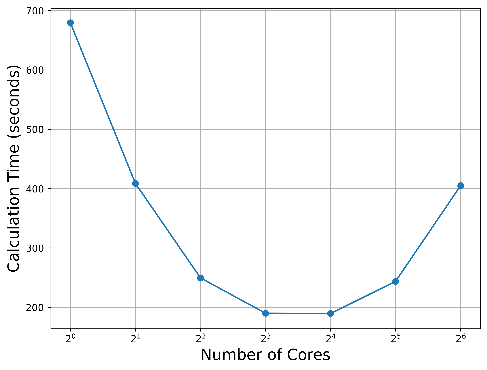

# Software Installed on Crux

This document provides notes on software I have manually installed on **Crux**.  
These steps are for personal reference and reproducibility — they are **not** intended as official or optimized installation instructions.

---

## ORCA 6.1.0

### Installation

1. Download ORCA from the [ORCA Forum](https://orcaforum.kofo.mpg.de/index.php).  
   For this setup, I used: **ORCA 6.1.0 — Linux x86-64 (.tar.xz), packaged with OpenMPI 4.1.8**

   ORCA requires a compatible OpenMPI installation for multi-core parallel runs.  
   This ORCA version recommends **OpenMPI 4.1.8**.

2. Download the appropriate OpenMPI version from:  
   https://www-lb.open-mpi.org/

3. Extract the archive:

```bash
tar -xf openmpi-4.1.8.tar.gz
```

4. Configure and build OpenMPI on a compute node:

```bash

cd /path/to/openmpi-4.1.8
module load PrgEnv-gnu

./configure CC=gcc CXX=g++ FC=gfortran F77=gfortran \
    --prefix=/path/to/openmpi-4.1.8 \
    --with-pmix=internal \
    --with-libevent=internal

make -j8
make install
```

### Environment setup

```bash
# Orca
export PATH=/path/to/orca_6_1_0_linux_x86-64_shared_openmpi418:$PATH
export LD_LIBRARY_PATH=/path/to/orca_6_1_0_linux_x86-64_shared_openmpi418:$LD_LIBRARY_PATH

#OpenMPI
export PATH=/path/to/openmpi-4.1.8/bin:$PATH
export LD_LIBRARY_PATH=/path/to/openmpi-4.1.8/lib:$LD_LIBRARY_PATH
```

### Running an ORCA Calculation

Example submission script
```bash
#!/bin/bash -l
#PBS -l walltime=01:00:00
#PBS -l select=1:system=crux
#PBS -l filesystems=home:eagle
#PBS -q workq-route
#PBS -A your_account
#PBS -N ORCA

cd $PBS_O_WORKDIR

full/path/to/orca test.inp
```

8. Scaling performance on 1 node:



## Sample Input (test.inp) for Scaling Test:

```bash
!PBE DEF2-SVP OPT
%maxcore 4000
%PAL NPROCS 1 END
* xyz 0 2
Ni    0.261813   -0.000018    0.000010
 C    0.148412   -3.304667    0.000283
 C   -1.195937   -2.647547    0.000151
 N   -1.255395   -1.328561    0.000510
 C   -2.466723   -0.718439    0.000169
 C   -3.676140   -1.411181    0.000225
 C   -3.600459   -2.818956   -0.000182
 C   -2.376815   -3.424576   -0.000028
 C   -4.907203   -0.675860   -0.000028
 C   -4.907186    0.675914   -0.000071
 C   -3.676106    1.411217   -0.000289
 C   -2.466699    0.718457   -0.000202
 N   -1.255362    1.328558   -0.000510
 C   -1.195885    2.647544   -0.000146
 C   -2.376748    3.424592    0.000002
 C   -3.600404    2.818994    0.000122
 C    0.148475    3.304641   -0.000238
 H    0.945199   -2.562443    0.000180
 H    0.256124   -3.940627   -0.880282
 H    0.256157   -3.940768    0.880675
 H   -4.510836   -3.406236   -0.000321
 H   -2.289733   -4.503000    0.000121
 H   -5.839250   -1.227342   -0.000259
 H   -5.839214    1.227407    0.000136
 H   -2.289648    4.503015   -0.000141
 H   -4.510771    3.406287    0.000238
 H    0.945248    2.562403   -0.000130
 H    0.256174    3.940584    0.880340
 H    0.256247    3.940754   -0.880617
Cl    2.421242   -0.000037    0.000009
*

```